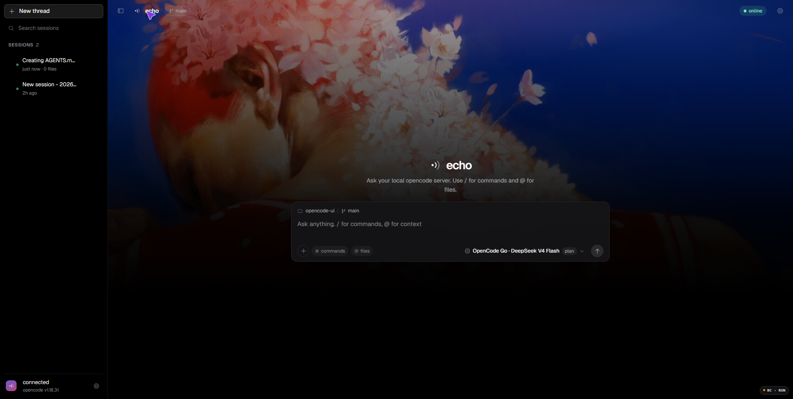
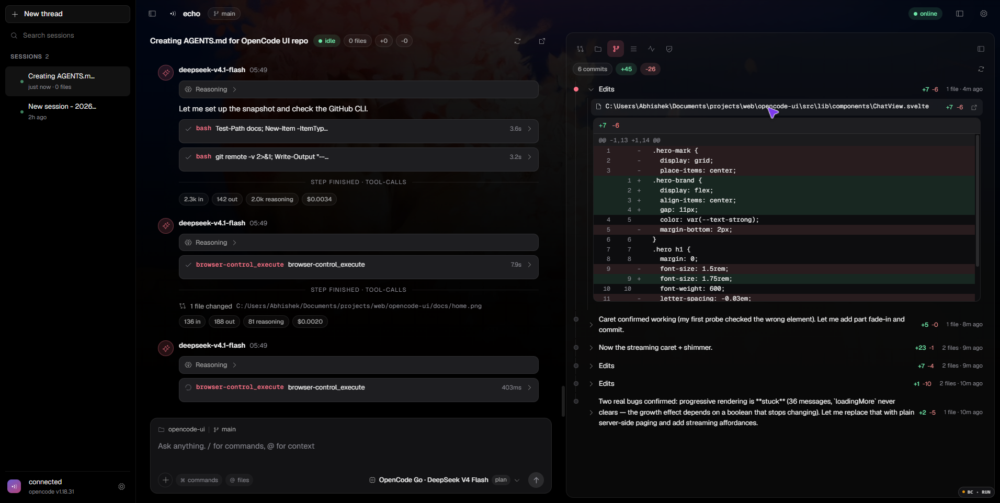

<div align="center">



# echo

A fast, focused desktop client for a running [opencode](https://opencode.ai) server.

Svelte 5 (runes) · Vite · TypeScript

</div>

---

**echo** talks directly to `opencode serve` over its HTTP API and SSE event
stream. There is no backend, no proxy, and no telemetry — the browser is the
client, your opencode instance is the server.

This is a personal frontend, not the opencode TUI and not the official web app.

## Features

- **Chat** with live streaming responses, tool calls, reasoning blocks, and
  syntax-highlighted markdown.
- **`@` file mentions and `/` commands** with full keyboard navigation
  (Arrow keys, Enter/Tab to accept, Escape to dismiss).
- **Session tree** — sub-agent sessions nest under their parent, with a back
  link in the header.
- **Side panel** — Files, Changes, Diff, Todos, Status, and Access, each in a
  single docked panel.
- **Changes as a commit log** — every turn that edits files becomes an entry
  you can expand into its diff; changes open in a wide, dedicated Diff panel.
- **Live server status** — MCP servers, LSP, formatters, VCS branch, and
  sandbox permissions.
- **Permission prompts** surfaced in the panel with allow/reject actions.
- **Theming** — wallpaper by URL or **local file** (with drag & drop), an effect
  stack (bottom fade, dither, film grain, scanlines, vignette, bloom), ambient
  drift, and a luminance-aware scrim so text stays readable over light artwork.
- **Resilient** — the event stream reconnects with exponential backoff, and
  panel layout plus your last session persist across reloads.
- **Fast on long threads** — messages are paged from the server, markdown is
  parsed lazily as it enters the viewport, and streaming text gets a caret.

<p align="center">
  
</p>

## Requirements

- **Node.js 20.19+** (or 22.12+) — Vite 8 requires it.
- A running **opencode server**. Start one with CORS enabled for the dev server:

  ```sh
  opencode serve --port 4096 --cors http://localhost:5173
  ```

## Quick start

```sh
npm install
npm run dev
```

Open <http://localhost:5173>. echo probes the server on load and shows a
connection chip; if it can't reach it, open **Settings** and set the base URL
(defaults to `http://127.0.0.1:4096`), optional basic-auth credentials, and an
optional project directory.

For a production build:

```sh
npm run build     # emits to dist/
npm run preview   # serves the build locally
```

## Configuration

Everything is configured at runtime in the settings modal and persisted to
`localStorage` — there are no environment variables.

| Setting     | Purpose                                             |
| ----------- | --------------------------------------------------- |
| Base URL    | Where `opencode serve` is listening                 |
| Username    | Basic-auth user, if the server is protected         |
| Password    | Basic-auth password                                 |
| Directory   | Project directory to scope sessions to (optional)   |

Appearance settings (wallpaper, effects, and colours) live in the same modal.
Local wallpapers are embedded into browser storage, so pick something you don't
mind compressing.

## Architecture

```
src/
  main.ts                     mounts the app, loads Geist
  app.css                     design tokens, background + effect layers, primitives
  App.svelte                  shell, startup, event stream lifecycle, drag & drop wallpaper
  lib/
    api.ts                    SDK client factory, basic auth, /global/health probe
    events.ts                 the single SSE reducer (handleEvent)
    image.ts                  local wallpaper import (resize + encode)
    markdown.ts               marked + DOMPurify + highlight.js + lazy visibility
    diff.ts                   structured diff helpers
    stores/*.svelte.ts        rune-based singleton stores
    components/*.svelte       presentational components
```

- **Stores** are plain classes using `$state`/`$derived`, instantiated once and
  exported (`connection`, `chat`, `sessions`, `models`, `status`,
  `permissions`, `files`, `ui`). This is *not* the Svelte 4 store API.
- **Server events** are handled in one place, `lib/events.ts`, which mutates the
  stores. Components never parse raw events.
- **SDK calls** return `{ data, error }`; errors are checked, not thrown.

## Scripts

| Command           | Description                                          |
| ----------------- | ---------------------------------------------------- |
| `npm run dev`     | Vite dev server with HMR                             |
| `npm run build`   | Production build to `dist/`                          |
| `npm run preview` | Serve the built output                               |
| `npm run check`   | `svelte-check` + `tsc` — the only verification gate  |

## Notes

- The app is a client for **opencode**; it needs a server to be useful.
- `localStorage` keys are prefixed `opencode-ui:` for historical reasons. The
  prefix predates the echo rebrand and is kept on purpose so existing settings
  keep working.

## License

Released under the [MIT License](LICENSE).
